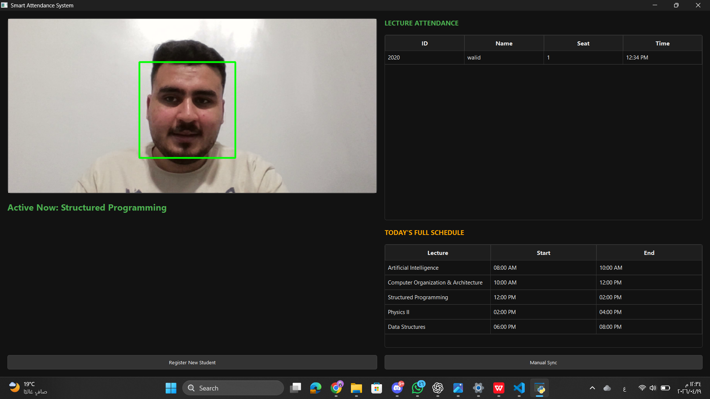
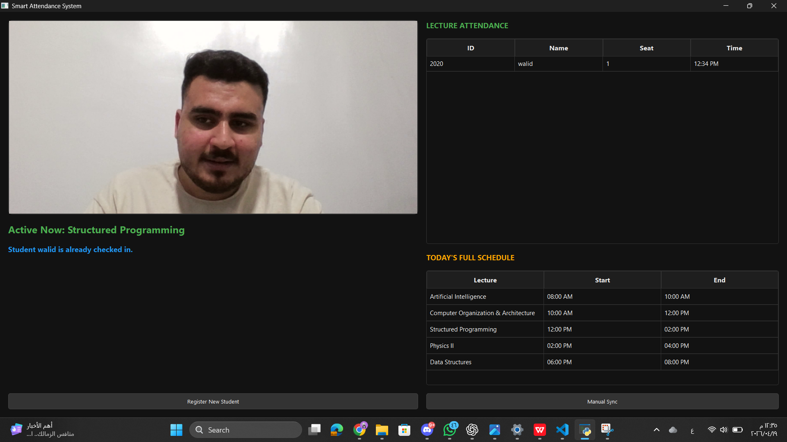

<div align="center">

# SMARTGATE

### AI-Powered Smart Attendance System

<p>
An intelligent desktop application that automates university attendance
using real-time facial recognition and lecture scheduling.
</p>

<br>

<a href="https://github.com/mohamedwalidhegab12-dev/Smart_Attendance_System">

</a>

<br><br>


<br><br>

<em>Recognize. Verify. Record.</em>

</div>

---

## 📌 Project Overview

**SmartGate** is an AI-powered university attendance system designed to
automate the process of identifying students and recording their attendance.

The system combines **Computer Vision, Face Recognition, Deep Learning,
Database Management, and Desktop Application Development** into one
integrated workflow.

Instead of relying on traditional manual attendance, SmartGate uses a
camera to recognize registered students and automatically connect their
presence to the currently active lecture.

---

## 🎯 The Problem

Traditional attendance methods can be:

- Time-consuming
- Repetitive
- Difficult to manage
- Prone to duplicate records
- Dependent on manual data entry

SmartGate was designed to provide a more automated and structured approach.

---

## 💡 The Solution

SmartGate connects the complete attendance process into one intelligent pipeline:

<div align="center">

<table>
<tr>

<td align="center" width="20%">

### 📷

<strong>Camera</strong>

<br>

<sub>Live video input</sub>

</td>

<td align="center" width="20%">

### 👤

<strong>Recognition</strong>

<br>

<sub>Face identification</sub>

</td>

<td align="center" width="20%">

### 📚

<strong>Lecture</strong>

<br>

<sub>Schedule validation</sub>

</td>

<td align="center" width="20%">

### ✓

<strong>Attendance</strong>

<br>

<sub>Record validation</sub>

</td>

<td align="center" width="20%">

### 🗄️

<strong>Database</strong>

<br>

<sub>Persistent storage</sub>

</td>

</tr>
</table>

</div>

---

# ✨ Key Features

<div align="center">

<table>

<tr>

<td width="50%" valign="top">

### 👤 Face Recognition

Real-time student identification using:

- DeepFace
- ArcFace
- Facial embeddings
- Cosine distance
- Recognition threshold

</td>

<td width="50%" valign="top">

### 📝 Smart Attendance

Automatically:

- Identifies registered students
- Detects the active lecture
- Records attendance
- Prevents duplicate records

</td>

</tr>

<tr>

<td width="50%" valign="top">

### 👨‍🎓 Student Registration

Dedicated workflow for:

- Student information
- Camera capture
- Face embedding generation
- Duplicate validation
- Database registration

</td>

<td width="50%" valign="top">

### 📅 Lecture Scheduling

Schedule-aware attendance based on:

- Current day
- Current time
- Lecture start time
- Lecture end time
- Active lecture detection

</td>

</tr>

<tr>

<td width="50%" valign="top">

### 🖥️ Real-Time Dashboard

PyQt5 interface providing:

- Live camera feed
- Attendance information
- Lecture information
- Daily schedule
- System status

</td>

<td width="50%" valign="top">

### 🗄️ Database Management

SQLite stores:

- Student information
- Face embeddings
- Lecture schedules
- Attendance records

</td>

</tr>

</table>

</div>

---

# 🧠 How SmartGate Works

<div align="center">

<table>

<tr>
<th>Stage</th>
<th>Process</th>
<th>Technology</th>
</tr>

<tr>
<td align="center"><strong>01</strong></td>
<td>Capture live camera frames</td>
<td>OpenCV</td>
</tr>

<tr>
<td align="center"><strong>02</strong></td>
<td>Process and detect the face</td>
<td>Computer Vision</td>
</tr>

<tr>
<td align="center"><strong>03</strong></td>
<td>Generate facial embedding</td>
<td>DeepFace / ArcFace</td>
</tr>

<tr>
<td align="center"><strong>04</strong></td>
<td>Compare with registered embeddings</td>
<td>Cosine Distance</td>
</tr>

<tr>
<td align="center"><strong>05</strong></td>
<td>Identify the registered student</td>
<td>Recognition Engine</td>
</tr>

<tr>
<td align="center"><strong>06</strong></td>
<td>Check the active lecture</td>
<td>Schedule Logic</td>
</tr>

<tr>
<td align="center"><strong>07</strong></td>
<td>Validate attendance</td>
<td>Attendance Logic</td>
</tr>

<tr>
<td align="center"><strong>08</strong></td>
<td>Store and display the result</td>
<td>SQLite + PyQt5</td>
</tr>

</table>

</div>

---

# 🏗️ System Architecture

<div align="center">

<table>

<tr>

<td align="center" width="25%">

### Presentation Layer

<strong>PyQt5</strong>

<br><br>

Dashboard  
Registration  
System Status

</td>

<td align="center" width="25%">

### AI Layer

<strong>DeepFace</strong>  
<strong>ArcFace</strong>  
<strong>Embeddings</strong>

<br><br>

Face Recognition

</td>

<td align="center" width="25%">

### Logic Layer

<strong>Lecture Validation</strong>  
<strong>Attendance Rules</strong>  
<strong>Recognition Logic</strong>

</td>

<td align="center" width="25%">

### Data Layer

<strong>SQLite</strong>

<br><br>

Students  
Schedule  
Attendance

</td>

</tr>

</table>

</div>

---

# 👁️ Face Recognition Pipeline

The recognition engine follows a controlled process from camera input
to verified student identification.

### 01 — Capture

OpenCV receives frames from the connected camera.

### 02 — Face Processing

The current frame is processed for facial recognition.

### 03 — Embedding Generation

DeepFace uses **ArcFace** to generate a numerical representation
of the detected face.

### 04 — Face Comparison

The generated embedding is compared against registered embeddings
using **cosine distance**.

### 05 — Threshold Validation

The current implementation uses:

```text
Recognition Threshold = 0.4
```

### 06 — Student Identification

The closest valid registered student is selected.

---

# 📋 Attendance Workflow

<div align="center">

<table>

<tr>

<td align="center">

<strong>01</strong>

<br><br>

Face Detected

</td>

<td align="center">

→

</td>

<td align="center">

<strong>02</strong>

<br><br>

Student Identified

</td>

<td align="center">

→

</td>

<td align="center">

<strong>03</strong>

<br><br>

Active Lecture Checked

</td>

<td align="center">

→

</td>

<td align="center">

<strong>04</strong>

<br><br>

Duplicate Validated

</td>

<td align="center">

→

</td>

<td align="center">

<strong>05</strong>

<br><br>

Attendance Recorded

</td>

</tr>

</table>

</div>

The system separates **recognition** from **attendance recording**.

A recognized face is not automatically treated as a valid attendance
record until the current lecture and attendance conditions are verified.

---

# 🗄️ Database Architecture

SmartGate uses a local SQLite database:

```text
University.db
```

The database is organized around three main areas.

<div align="center">

<table>

<tr>

<th>Data</th>
<th>Purpose</th>
<th>Main Information</th>

</tr>

<tr>

<td>
<strong>Student Data</strong>
</td>

<td>
Registered student information
</td>

<td>
ID · Name · Level · Department · Email · Face Embedding
</td>

</tr>

<tr>

<td>
<strong>Schedule Data</strong>
</td>

<td>
Active lecture detection
</td>

<td>
Lecture ID · Course · Day · Start Time · End Time
</td>

</tr>

<tr>

<td>
<strong>Attendance Data</strong>
</td>

<td>
Generated attendance records
</td>

<td>
Student · Lecture · Date · Check-in Time
</td>

</tr>

</table>

</div>

---

# 📁 Project Structure

<details>

<summary><strong>View Project Structure</strong></summary>

<br>

```text
Smart_Attendance_System/
│
├── AttendanceDashboard.py
│   └── Main PyQt5 application
│
├── Register.py
│   └── Student registration
│
├── cameraThread.py
│   └── Camera processing thread
│
├── Embedding_pic.py
│   └── Face embedding generation
│
├── Compare_with_database.py
│   └── Face comparison
│
├── Mark_attendance.py
│   └── Attendance recording
│
├── Fetch_lecture.py
│   └── Lecture scheduling logic
│
├── Dashboard_data.py
│   └── Dashboard data operations
│
├── Data_Model.py
│   └── Application data models
│
├── DB_Setup.py
│   └── Database initialization
│
├── DB_Students.py
│   └── Student database operations
│
├── DB_Attendees.py
│   └── Attendance database operations
│
├── DB_Schedule.py
│   └── Schedule database operations
│
├── SQL_command.sql
│   └── SQL commands
│
├── Dark_Mood.py
│   └── Application styling
│
├── University.db
│   └── SQLite database
│
├── images/
│   ├── demo1.png
│   └── demo2.png
│
└── README.md
```

</details>

---

# 🖥️ Application Preview

The following screenshots demonstrate the SmartGate application interface.

<div align="center">



<br>

<sub><strong>SmartGate Main Dashboard</strong></sub>

<br><br>



<br>

<sub><strong>SmartGate Application Interface</strong></sub>

</div>

---

# 🛠️ Technology Stack

<div align="center">

<table>

<tr>

<th>Technology</th>
<th>Role in the Project</th>

</tr>

<tr>

<td>
<strong>Python</strong>
</td>

<td>
Core application development
</td>

</tr>

<tr>

<td>
<strong>DeepFace</strong>
</td>

<td>
Facial recognition pipeline
</td>

</tr>

<tr>

<td>
<strong>ArcFace</strong>
</td>

<td>
Face embedding generation
</td>

</tr>

<tr>

<td>
<strong>OpenCV</strong>
</td>

<td>
Camera input and computer vision
</td>

</tr>

<tr>

<td>
<strong>NumPy</strong>
</td>

<td>
Numerical and vector operations
</td>

</tr>

<tr>

<td>
<strong>PyQt5</strong>
</td>

<td>
Desktop graphical interface
</td>

</tr>

<tr>

<td>
<strong>SQLite</strong>
</td>

<td>
Persistent local database
</td>

</tr>

<tr>

<td>
<strong>TensorFlow</strong>
</td>

<td>
Deep learning backend
</td>

</tr>

</table>

</div>

---

# ⚙️ Getting Started

## Prerequisites

Make sure you have:

- Python 3.10+
- Git
- A working webcam
- A compatible Python environment

---

## 1. Clone the Repository

```bash
git clone https://github.com/mohamedwalidhegab12-dev/Smart_Attendance_System.git

cd Smart_Attendance_System
```

---

## 2. Create a Virtual Environment

```bash
python -m venv venv
```

### Windows

```bash
venv\Scripts\activate
```

### Linux / macOS

```bash
source venv/bin/activate
```

---

## 3. Install Dependencies

```bash
pip install opencv-python
pip install deepface
pip install numpy
pip install PyQt5
pip install tensorflow
```

---

## 4. Initialize the Database

```bash
python DB_Setup.py
```

---

## 5. Run SmartGate

```bash
python AttendanceDashboard.py
```

---

# 👨‍🎓 Student Registration

The registration module follows a dedicated workflow:

<div align="center">

<table>

<tr>

<td align="center">

<strong>Student Information</strong>

</td>

<td align="center">→</td>

<td align="center">

<strong>Camera Capture</strong>

</td>

<td align="center">→</td>

<td align="center">

<strong>Face Embedding</strong>

</td>

<td align="center">→</td>

<td align="center">

<strong>Validation</strong>

</td>

<td align="center">→</td>

<td align="center">

<strong>Database</strong>

</td>

</tr>

</table>

</div>

The system validates submitted information and performs duplicate checks
before registering the student.

---

# 🔐 Attendance Validation

SmartGate does not treat every recognition event as a new attendance record.

The system validates:

- Student identity
- Active lecture
- Existing attendance status

before creating a new attendance entry.

This helps maintain cleaner and more reliable attendance data.

---

# 🧵 Real-Time Processing

The camera processing is separated from the graphical interface using
a dedicated camera thread.

This allows the application to:

- Continuously process camera frames
- Keep the PyQt5 interface responsive
- Update recognition results in real time
- Separate camera processing from UI operations

---

# 💡 Engineering Highlights

SmartGate demonstrates the integration of:

<div align="center">

<table>

<tr>

<td align="center">

<strong>Artificial Intelligence</strong>

<br><br>

Face Recognition  
Deep Learning  
Embeddings

</td>

<td align="center">

<strong>Computer Vision</strong>

<br><br>

Camera Processing  
Face Detection  
Real-Time Frames

</td>

<td align="center">

<strong>Software Engineering</strong>

<br><br>

Modular Architecture  
Threading  
GUI Development

</td>

<td align="center">

<strong>Database Engineering</strong>

<br><br>

SQLite  
SQL  
Attendance Management

</td>

</tr>

</table>

</div>

---

# 🧩 Design Decisions

## Recognition ≠ Attendance

The project intentionally separates face recognition from attendance
management.

```text
Recognition
     ↓
Student Identity
     ↓
Lecture Validation
     ↓
Attendance Validation
     ↓
Database Record
```

This creates a cleaner separation between AI processing and business logic.

---

## Modular Database Layer

Database operations are separated into dedicated modules for:

- Students
- Attendance
- Schedule
- Database initialization

This reduces coupling between the AI system, GUI and database.

---

## Threaded Camera Processing

Camera operations are handled separately from the main GUI thread
to improve application responsiveness.

---

# 🚀 Future Roadmap

<div align="center">

<table>

<tr>

<th>Status</th>
<th>Planned Improvement</th>

</tr>

<tr>

<td>🔲</td>
<td>Advanced liveness / anti-spoofing</td>

</tr>

<tr>

<td>🔲</td>
<td>Attendance analytics dashboard</td>

</tr>

<tr>

<td>🔲</td>
<td>CSV / Excel attendance reports</td>

</tr>

<tr>

<td>🔲</td>
<td>Administrator authentication</td>

</tr>

<tr>

<td>🔲</td>
<td>Cloud database integration</td>

</tr>

<tr>

<td>🔲</td>
<td>Web administration dashboard</td>

</tr>

<tr>

<td>🔲</td>
<td>Multi-camera support</td>

</tr>

<tr>

<td>🔲</td>
<td>University-wide deployment</td>

</tr>

</table>

</div>

---

# 👥 Development Team

<div align="center">

<table>

<tr>

<td align="center" width="20%">

<strong>Mohamed Walid</strong>

<br><br>

AI / Software Development

</td>

<td align="center" width="20%">

<strong>Malak Eldesouky</strong>

<br><br>

Team Member

</td>

<td align="center" width="20%">

<strong>Saif Gamal</strong>

<br><br>

Team Member

</td>

<td align="center" width="20%">

<strong>John Hady</strong>

<br><br>

Team Member

</td>

<td align="center" width="20%">

<strong>Fatma Gahlan</strong>

<br><br>

Team Member

</td>

</tr>

</table>

<br>

<strong>Supervisor</strong>

<br><br>

Mohamed Eleraqy

</div>

---

# 🎓 Academic Project

SmartGate was developed as an academic project focused on applying
**Artificial Intelligence and Software Engineering** to a real-world
university problem.

### Core Areas

<div align="center">

<br>

<code>Artificial Intelligence</code>
&nbsp;&nbsp;
<code>Computer Vision</code>
&nbsp;&nbsp;
<code>Face Recognition</code>

<br><br>

<code>Deep Learning</code>
&nbsp;&nbsp;
<code>Database Systems</code>
&nbsp;&nbsp;
<code>Desktop Applications</code>

</div>

---

<div align="center">

<br><br>

<h1>SMARTGATE</h1>

<h3>Recognize. Verify. Record.</h3>

<br>


<br><br>

<a href="https://github.com/mohamedwalidhegab12-dev/Smart_Attendance_System">


</a>

<br><br>

<sub>
Built with Python · DeepFace · ArcFace · OpenCV · PyQt5 · SQLite
</sub>

<br><br>

</div>
